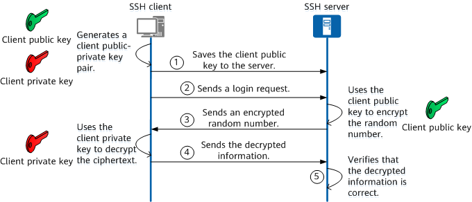

You're working in a git repository and you're ready to push your commits into `main`. You type in the command, but then you get asked for your username and password. No biggie. You enter, but then Github tells you that they removed password-based authentication. What are you supposed to do now?

# Personal Access Token with HTTPS

1. Go to *Settings* > *Developer Settings* > *Personal Access Tokens* and create a new personal access token.
    - Define the scope of access and expiration time.
2. Copy and save the generated token somewhere safe.
3. Now in the prompt, put your username and the token as the password.
4. You will have to do this every time for every request.

## Make life easier with Github Credential Manager

1. Install here: https://github.com/git-ecosystem/git-credential-manager/blob/release/docs/install.md
2. After installation, you need to login in once with your PAT.
3. After that, you don't need to authenticate every time.

## More info
- [Why?](https://docs.github.com/en/get-started/getting-started-with-git/why-is-git-always-asking-for-my-password)
- https://docs.github.com/en/authentication/keeping-your-account-and-data-secure/managing-your-personal-access-tokens
- https://github.blog/2020-07-02-git-credential-manager-core-building-a-universal-authentication-experience/

# SSH

1. Make sure that you cloned your repository using the SSH protocol.
2. [Generate a SSH key](https://docs.github.com/en/authentication/connecting-to-github-with-ssh/generating-a-new-ssh-key-and-adding-it-to-the-ssh-agent?platform=linux) on your machine. 
3. Create a new SSH key on Github, go into the file where you save the public key (ends with `.pub`) and copy and paste it into your new SSH key.
4. You should now have the ability to push your code without have to authenticate every time.

## Notes
- SSH is considered more secure than HTTPS authentication.
- Here is how it works: 
    - SSH generates a public and private key on your machine. The public key can be share with Github (and others), while the private key should remain secret on your machine only.
    - Whenever you make a request to Github, Github uses the shared public key to encrypt a message that can only be decrypted by your private key. It sends it back to your request.
    - Your machine attempts to decrypt it. Since your machine has the private key, it should be able to decrypt it. Your machine then sends back the decrypted message for Github to verify.
    - Github successfully verifies the message and authenticates your request.

Here's a good image visualizing the steps:

## More info
- https://docs.github.com/en/authentication/connecting-to-github-with-ssh/about-ssh
- https://stackoverflow.com/questions/67077837/in-what-ways-is-an-ssh-key-different-from-tokens-for-git-authentication#:~:text=While%20SSH%20keys%20can%20be,recommends%20tokens%20over%20SSH%20keys.
